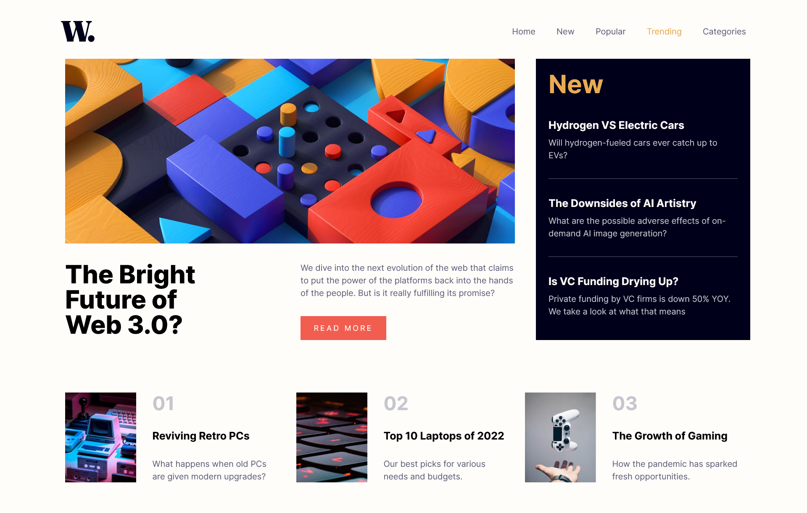
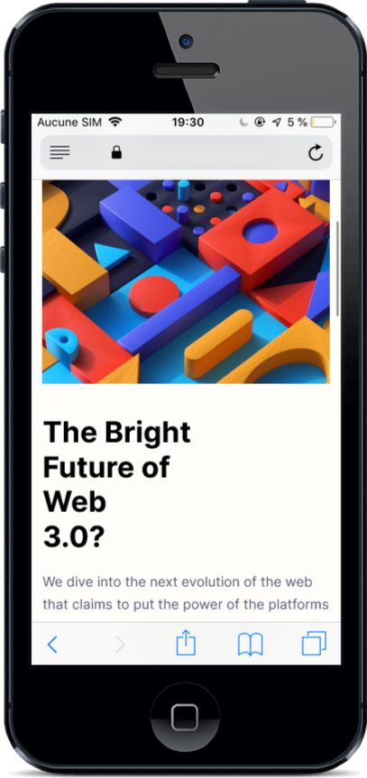
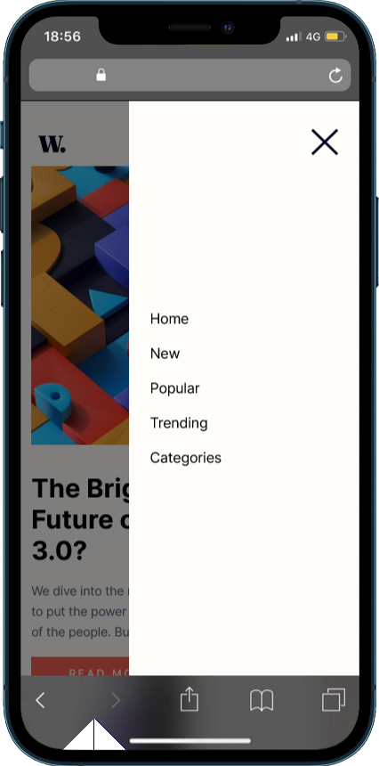

# Frontend Mentor - News homepage solution

This is a solution to the [News homepage challenge on Frontend Mentor](https://www.frontendmentor.io/challenges/news-homepage-H6SWTa1MFl). Frontend Mentor challenges help you improve your coding skills by building realistic projects.

## Table of contents

- [Frontend Mentor - News homepage solution](#frontend-mentor---news-homepage-solution)
  - [Table of contents](#table-of-contents)
  - [Overview](#overview)
    - [The challenge](#the-challenge)
    - [Screenshot](#screenshot)
    - [Links](#links)
  - [My process](#my-process)
    - [Built with](#built-with)
    - [What I learned](#what-i-learned)
    - [Continued development](#continued-development)
    - [Useful resources](#useful-resources)
  - [Author](#author)

## Overview

### The challenge

Users should be able to:

- View the optimal layout for the interface depending on their device's screen size
- See hover and focus states for all interactive elements on the page

### Screenshot





### Links

- Solution URL: [Github Repo](https://github.com/Gandah/news-homepage.git)
- Live Site URL: [Add live site URL here](https://your-live-site-url.com)

## My process

### Built with

- Semantic HTML5 markup
- CSS custom properties
- Flexbox
- CSS Grid
- Mobile-first workflow
- [React](https://reactjs.org/) - JS library
- Tailwind CSS

### What I learned

- Using ternary operators to add and remove tailwind css classes.

```jsx
//Main.jsx line 60 
className={`bg-softRed hover:bg-darkBlue px-4 py-3 md:py-2 h-auto w-[50%] md:w-[40%] uppercase text-center md:grid place-items-center ${} animate ? "animate-[wiggle_2s_ease-in-out_2]" : ""} `}
```

### Continued development

- React Hooks
- Css Animatons
- React Native

### Useful resources

- [Css Animate](https://animate.style/) - This helped me animate some buttons and cards on the app.

## Author

- Website - [MyLinkedIn](https://www.linkedin.com/in/gandahkelvin)
- Frontend Mentor - [@Gandah](https://www.frontendmentor.io/profile/Gandah)
- Twitter - [@mr_g4nderson](https://twitter.com/mr_g4nderson?t=A5NobjZab2sVEdh3Zq9s0A&s=09)
